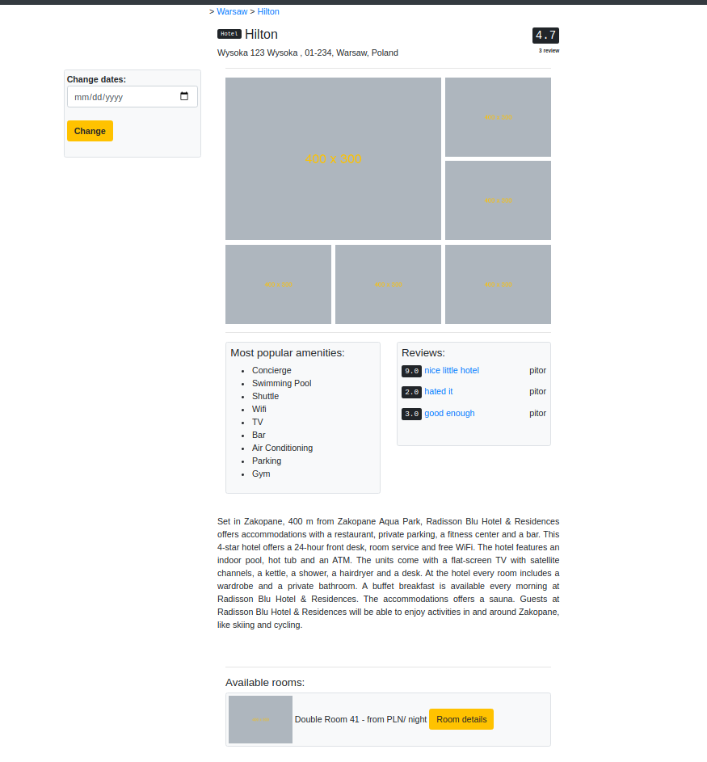
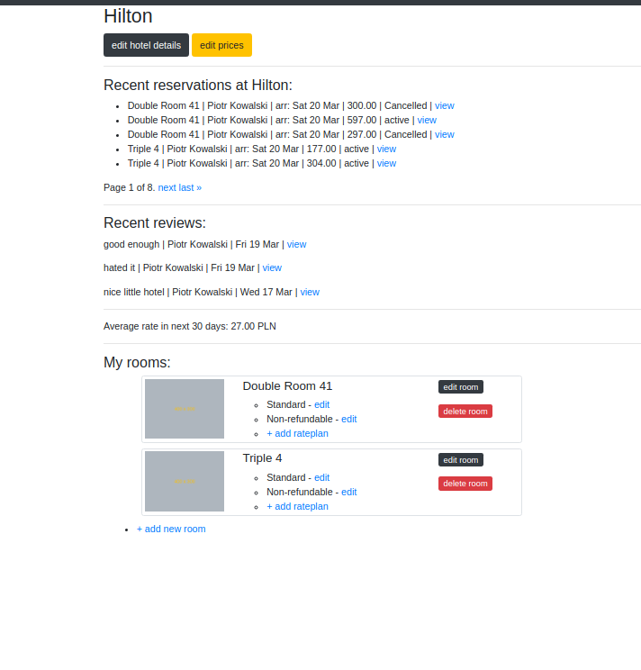
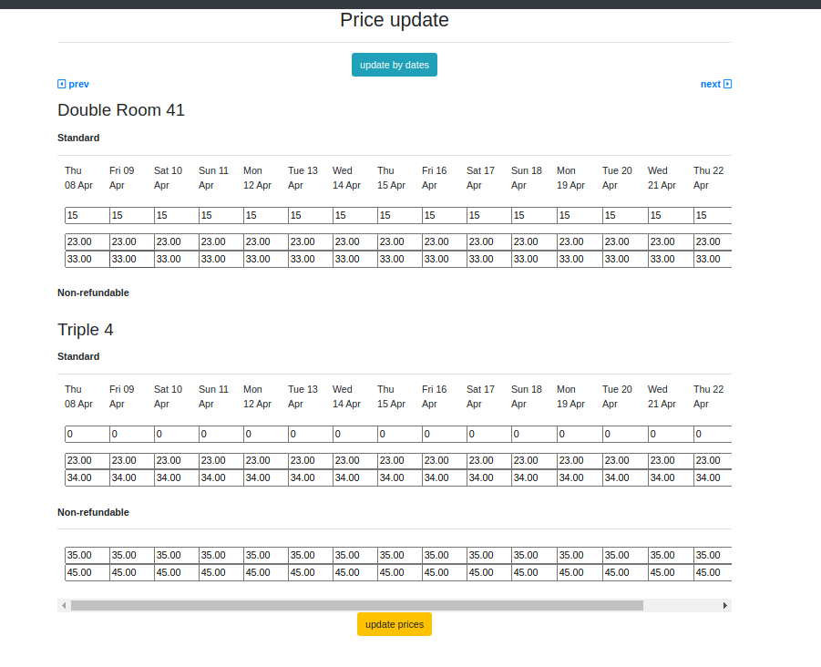

# ota_app
Application based on most popular online travel agencies like Booking.com and Expedia. Allows hoteliers to list their properties, input sell their room inventory.
## technologies:
* Python 3.8
* Django 3.1.7
* Bootstrap 4

Application supports following functionalities:
* Two user groups(hotel owner, user)
* Create hotel with hotel amenities(Wifi, Bar, Restaurant etc.)
* Create rooms within hotel with amenities
* Create rateplans with prices, cancellation policy and prices for each date
* Create hotel reviews by users who completed their stay at hotel
* Calendar-based rates and availability update
* Bulk-update of rates and availability
* Cancellation of reservations (rooms are released back to hotel inventory)
* Information about average rate, recent reviews and reservations displayed on hotel's dashboard page

## Project status: ongoing

